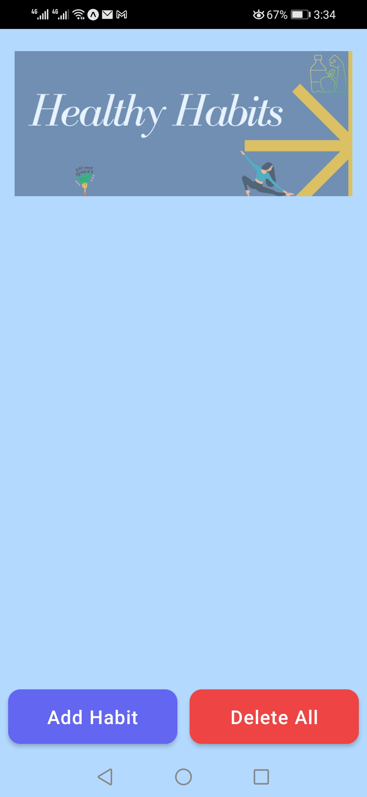
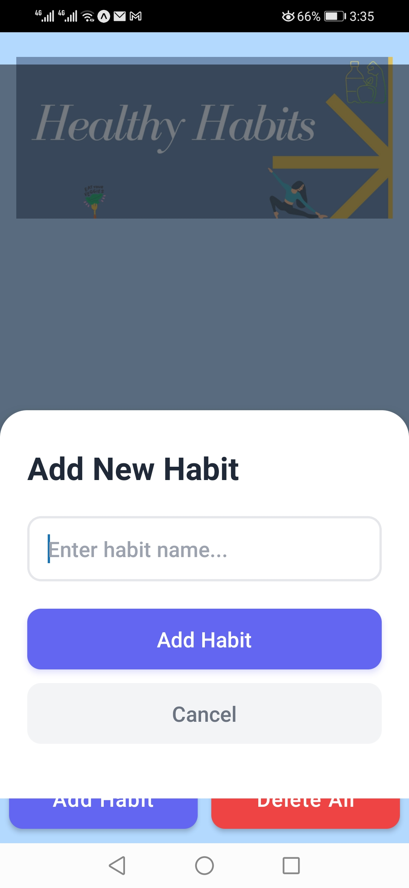
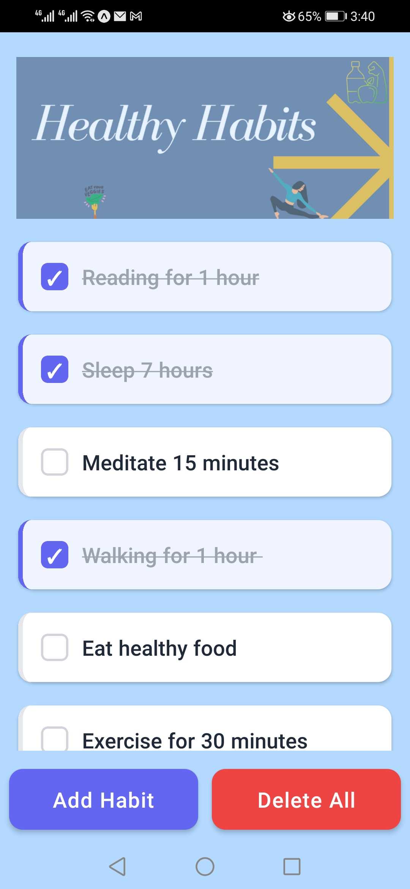

# Healthy Habits

A simple React Native app to track your daily healthy habits — add, check off, and manage your personal wellness routine.

## Screenshots

| Empty Screen | Add Habit | Habits List |
|:---:|:---:|:---:|
|  |  |  |

## Features

- Add new habits with a modal input
- Check off habits to mark them as done
- Delete individual habits with a long press
- Clear all habits at once

## Tech Stack

- [React Native](https://reactnative.dev/)
- [Expo](https://expo.dev/)

## Getting Started

### Prerequisites

- [Node.js](https://nodejs.org/)
- [Expo CLI](https://docs.expo.dev/get-started/installation/)

### Installation

```bash
npm install
```

### Run the app

```bash
npx expo start
```

Then scan the QR code with the **Expo Go** app on your phone, or press `a` for Android emulator / `i` for iOS simulator.

## Project Structure

```
├── App.js                  # Root component
├── components/
│   ├── HabitInput.js       # Modal input for adding habits
│   └── HabitItem.js        # Individual habit list item
├── assets/                 # Images and icons
└── app.json                # Expo configuration
```
